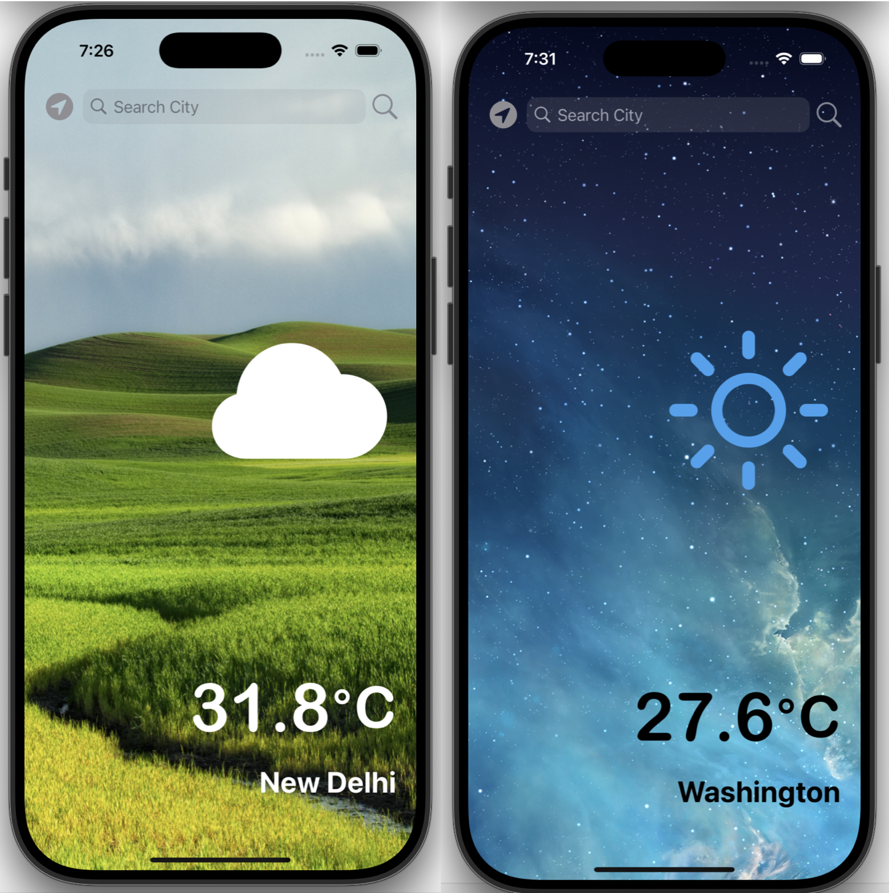

# ☀️ Weather iOS App

An elegant weather app built using UIKit and Apple’s Core Location framework. This app allows users to get the current weather for their city or current location, complete with light/dark mode support and beautiful SF Symbols for weather icons.

---
## Preview 
 

---
## 🌟 Features

- 🌍 Fetches weather using a city name or device location
- 📍 Uses **Core Location** to determine the user's current city
- 🔍 Search bar support to manually enter city names
- 🌦 Displays temperature, city name, and condition icon using **SF Symbols**
- 🌘 Supports both **Light** and **Dark** mode seamlessly
- ⚡ Fetches live weather data using a **Weather API**

---

## 🛠️ Technologies

- **Language:** Swift
- **UI Framework:** UIKit
- **Location Services:** CoreLocation
- **Networking:** `URLSession`, JSON Decoding
- **Icons:** SF Symbols
- **API:** OpenWeatherMap (or similar weather API)

---

### Prerequisites

- Xcode 13 or later
- iOS 13+ device or simulator
- API Key from OpenWeatherMap (or any weather service you use)

